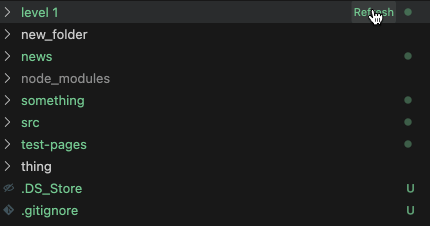

This is a demo repository trying to understand why in a vscode extension after calling `this._onDidChangeTreeData.fire(entry)` the entries remain expanded even though when calling `getChildren` all the folder entries are created as collapsed.

